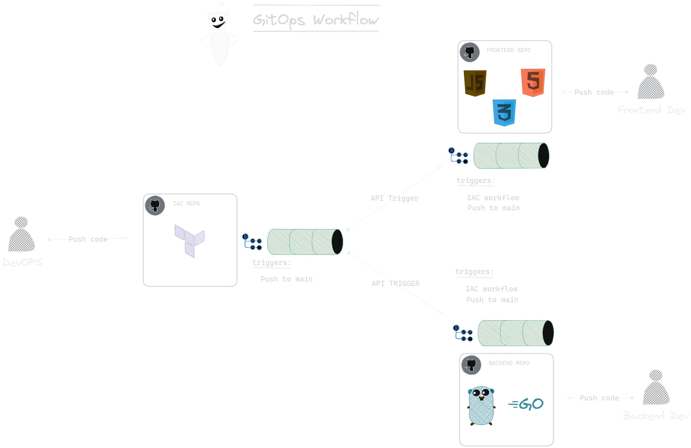

# Cloud Resume Challenge 2.0

## Introduction
This is my second CRC, the 1st - [Cloud Resume Challenge](https://github.com/Thab310/cloud-resume-challenge) was created using Cloudformation and python. On this one I am challenging myself to create it using terraform and Go.

Special shout out to [Forrest Brazeal](https://x.com/forrestbrazeal) the creater of the [CRC](https://cloudresumechallenge.dev/).

## Improvements
* I used terraform for IAC instead of AWS (serverless application model) SAM because it cloud agnostic.
* I used AWS Lambda function url instead of API Gateway in order to reduce complexity and optimise the application by getting rid of the addition network hop. :) less is more
* added terraform tests using terratest
* I decided to split the app into 3 different repos [Terraform](https://github.com/Thab310/crc-2.0-terraform), [Backend](https://github.com/Thab310/crc-2.0-backend) and [Frontend](https://github.com/Thab310/crc-2.0-frontend) each has it's own CI/CD pipeline
* S3 bucket is no longer public
* I decided to go for golang for my lambda instead of python because it is more performant

>[!NOTE]
This a `GitOps` implementaion. Many people think that GitOps means "ArgoCD" or flux but in actual fact. `GitOps is an operational framework based on DevOps practices`, like continous integration/continous delivery (CI/CD) and version control, which automates infrastructure and manages software deployment. Git must be the only source of truth for both infrustructure and application.

## Favourites
What I love most about having a multi-repo set-up is the simplicity it provides in a sense that each repo is smaller and manageble. Not to forget the fact that it's also independly deployable with it's own CICD pipeline. The reason I am going with this approach is because i want to leave a door for improvements both on the infrastructure level and backend api level, but that can very quickly become complex if everything is bundled in one repository.

## Downfalls
Because we are running the application from 3 repositories, and everytime we update our lambda terraform module, terraform will update the lambda code with our empty function because terraform cannot create a lambda function without uploading some code... Hence there will be a small downtime (`API will be down`) while the GitOps worflow is running and it will continue working after workflows is complete. 

The problem with this is that users that call this API, during this period will not get count as viewers. 

>[NOTE]
I am open to suggestions!

## Prequesites
* Install:
    * Terraform
    * AWS cli
    * Go
    * git
    * zip

### Architecture
>[!TIP]
When trying to build a project, always start by drawing the solution, once you visualize it, the technical nitty-gritties will fall ino place.
### GitOps Flows
We need to understand the flow very well. We basically have 3 repositories [Terraform](https://github.com/Thab310/crc-2.0-terraform), [Backend](https://github.com/Thab310/crc-2.0-backend) & [Frontend](https://github.com/Thab310/crc-2.0-frontend).

>[!NOTE]
The front-end website and backend go code need an infrastructure to run on, hence [Frontend](https://github.com/Thab310/crc-2.0-frontend) and [Backend](https://github.com/Thab310/crc-2.0-backend) is dependant on [Terraform](https://github.com/Thab310/crc-2.0-terraform).

When we update our terraform code, the [Terraform CI/CD](https://github.com/Thab310/crc-2.0-terraform) should run to completion and then trigger both the [Frontend CI/CD](https://github.com/Thab310/crc-2.0-frontend/) and [Backend CI/CD](https://github.com/Thab310/crc-2.0-backend). We should also have the freedom to update the Frontend code which will only run the it's own CD/CD workflow.

### Steps

1. Buy a domain name from [Amazon Route53](https://aws.amazon.com/route53/). You could also use any other domain name that you already have. In this project we will use route53, so select the domain name you like and then search for it's availability. 
.png)

If the domain name is available you will be forwarded to this page below to confirm your purchase of the domain. 

>[NOTE]
A `.com` domain on AWS costs `$14`
.png)
